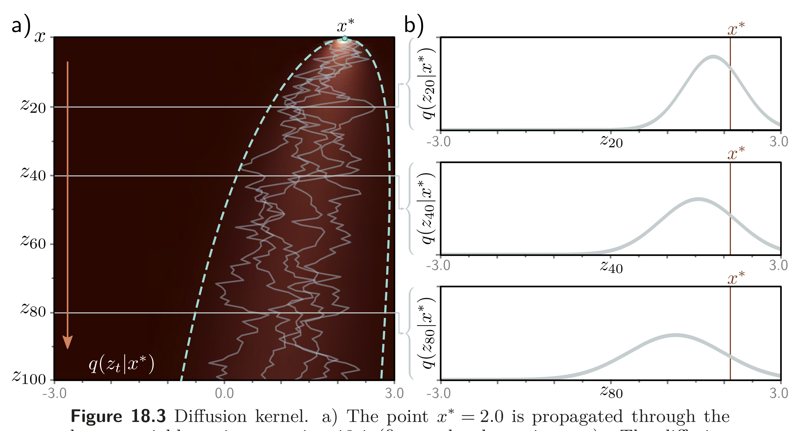
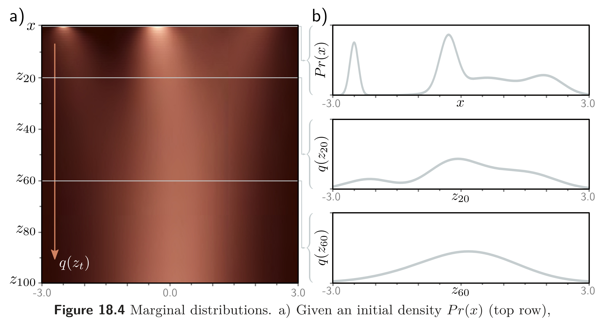

  

  <strong>Figure 18.3</strong> Diffusion kernel. a) The point $x^{*}=2.0$ is propagated through the latent variables using equation 18.1 (five paths shown in gray). The diffusion kernel $q(z_{t}|x^{*})$ is the probability distribution over variable $z_{t}$ given that we started from $x^{*}$. It can be computed in closed-form and is a normal distribution whose mean moves toward zero and whose variance increases as $t$ increases. Heatmap shows $q(z_{t}|x^{*})$ for each variable. Cyan lines show $\pm 2$ standard deviations from the mean. b) The diffusion kernel $q(z_{t}|x^{*})$ is shown explicitly for $t=20,40,80$. In practice, the diffusion kernel allows us to sample a latent variable $z_{t}$ corresponding to a given $x^{*}$ without computing the intermediate variables $z_{1},\ldots,z_{t-1}$. When $t$ becomes very large, the diffusion kernel becomes a standard normal.

  

  <strong>Figure 18.4</strong> Marginal distributions. a) Given an initial density $\Pr(x)$ (top row), the diffusion process gradually blurs the distribution as it passes through latent variables $z_{t}$ and moves it toward a standard normal distribution. Each subsequent horizontal line of heatmap represents a marginal distribution $q(z_{t})$. b) The top graph shows the initial distribution $\Pr(x)$. The other two graphs show the marginal distributions $q(z_{20})$ and $q(z_{60})$, respectively.

