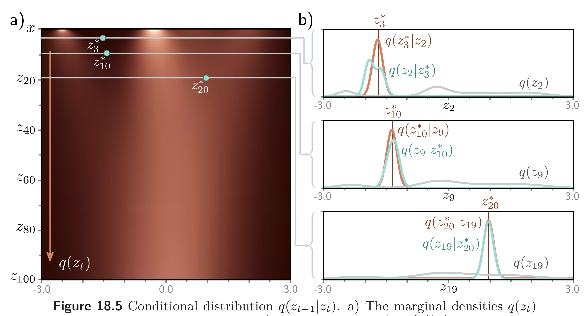
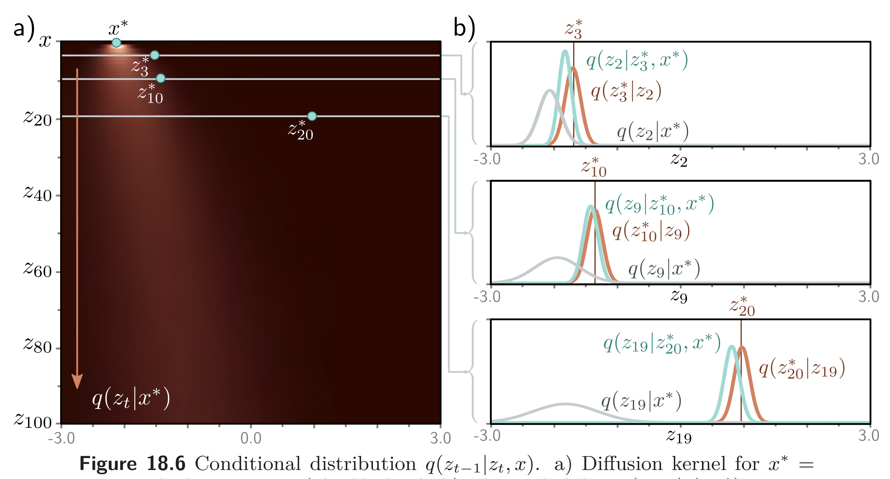

  

  <strong>Figure 18.5</strong> Conditional distribution $q(z\_{t-1}|z\_t)$ . a) The marginal densities $q(z\_t)$ with three points $z^*\_t$ highlighted. b) The probability $q(z\_{t-1}|z^*\_t)$ (cyan curves) is computed via Bayes' rule and is proportional to $q(z^*\_t|z\_{t-1})q(z\_{t-1})$ . In general, it is not normally distributed (top graph), although often the normal is a good approximation (bottom two graphs). The first likelihood term $q(z^*\_t|z\_{t-1})$ is normal in $z\_{t-1}$ (equation 18.2) with a mean that is slightly further from zero than $z^*\_t$ (brown curves). The second term is the marginal density $q(z\_{t-1})$ (gray curves).

  

  <strong>Figure 18.6</strong> Conditional distribution $q(z\_{t-1}|z\_t,x)$ . a) Diffusion kernel for $x^* = -2.1$ with three points $z\_t^*$ highlighted. b) The probability $q(z\_{t-1}|z\_t^*,x^*)$ is computed via Bayes' rule and is proportional to $q(z\_t^*|z\_{t-1})q(z\_{t-1}|x^*)$ . This is normally distributed and can be computed in closed form. The first likelihood term $q(z\_t^*|z\_{t-1})$ is normal in $z\_t$ (equation 18.2) with a mean that is slightly further from zero than $z\_t^*$ (brown curves). The second term is the diffusion kernel $q(z\_{t-1}|x^*)$ (gray curves).

