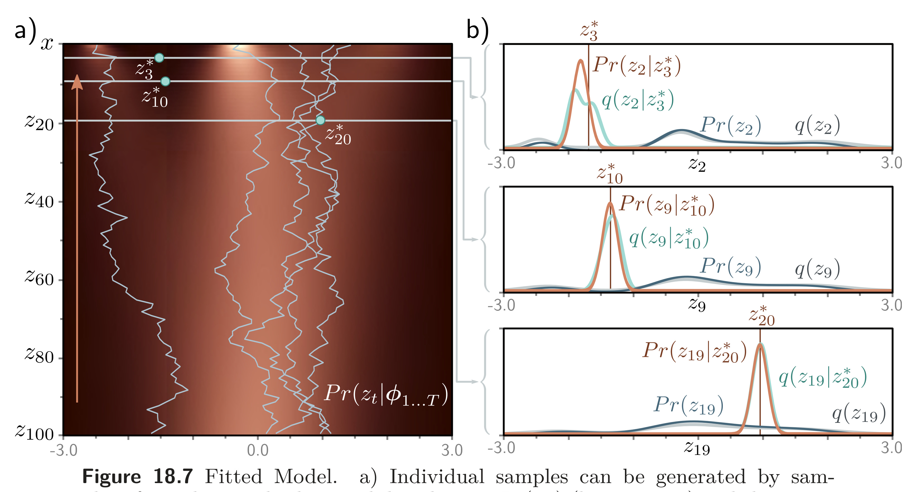

  

  <strong>Figure 18.7</strong> Fitted Model. a) Individual samples can be generated by sampling from the standard normal distribution $Pr(z_{T})$ (bottom row) and then sampling $z_{T-1}$ from $Pr(z_{T-1}|z_{T}) = \text{Norm}_{\mathbf{z}_{T-1}}[\mathrm{f}[z_{T},\phi_{\mathrm{T}}],\sigma_{\mathrm{T}}^{2}\mathbf{I}]$ and so on until we reach x (five paths shown). The estimated marginal densities (heatmap) are the aggregation of these samples and are similar to the true marginal densities (figure 18.4). b) The estimated distribution $Pr(z_{t-1}|z_{t})$ (brown curve) is a reasonable approximation to the true posterior of the diffusion model $q(z_{t-1}|z_{t})$ (cyan curve) from figure 18.5. The marginal distributions $Pr(z_{t})$ and $q(z_{t})$ of the estimated and true models (dark blue and gray curves, respectively) are also similar.

## 18.4.4 Diffusion loss function

To fit the model, we maximize the ELBO with respect to the parameters $\phi_{1\ldots T}$. We recast this as a minimization by multiplying with minus one and approximating the expectations with samples to give the loss function: 

$$
\begin{aligned}L[\phi_{1\ldots T}]&=\\&+\sum_{i=1}^{I}\Bigg(-\log\Big[\text{Norm}_{\mathbf{x}_{i}}\left[\mathbf{f}_{1}[z_{i1},\phi_{1}],\sigma^{2}\mathbf{I}\right]\Big]\\&\quad+\sum_{t=2}^{T}\frac{1}{2\sigma_{t}^{2}}\Bigg[\underbrace{\left|\frac{1-\alpha_{t-1}}{1-\alpha_{t}}\sqrt{1-\beta_{t}\mathbf{z}_{it}}+\frac{\sqrt{\alpha_{t-1}}\beta_{t}}{1-\alpha_{t}}\mathbf{x}_{i}-\underbrace{\mathbf{f}_{t}[\mathbf{z}_{it},\phi_{t}]}\right|}_{\text{target, mean of }q(\mathbf{z}_{t-1}|\mathbf{z}_{t},\mathbf{x})}\Bigg]^{2}\Bigg),\end{aligned} \quad (18.29)
$$

 where $\mathbf{x}_{i}$ is the $i^{th}$ data point, and $\mathbf{z}_{it}$ is the associated latent variable at diffusion step $t$.
