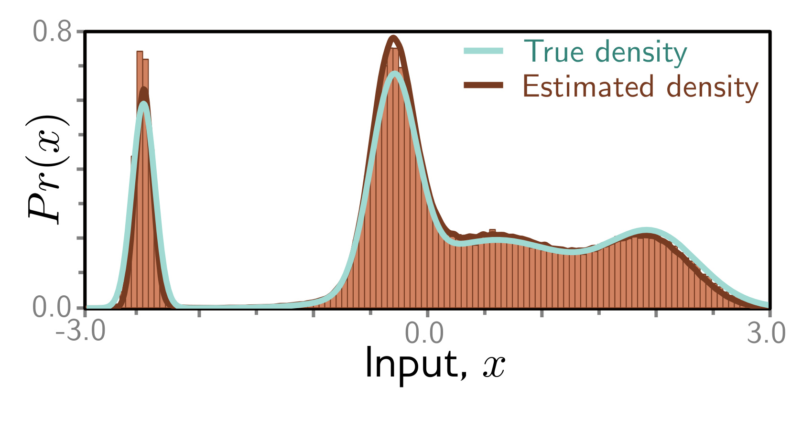

  

  <strong>Figure 18.8</strong> Fitted model results. Cyan and brown curves are original and estimated densities and correspond to the top rows of figures 18.4 and 18.7, respectively. Vertical bars are binned samples from the model, generated by sampling from $\Pr(\mathbf{z}\_{T})$ and propagating back through the variables $z\_{T-1}, z\_{T-2}, \ldots$ as shown for the five paths in figure 18.7.

## 18.4.5 Training procedure

This loss function can be used to train a network for each diffusion time step. It minimizes the difference between the estimate  $f\_{t}[z\_{t}, \phi\_{t}]$  of the hidden variable at the previous time step and the most likely value that it took given the ground truth de-posed data x.

Figures 18.7 and 18.8 show the fitted reverse process for the simple 1D example. This model was trained by (i) taking a large dataset of examples x from the original density, (ii) using the diffusion kernel to predict many corresponding values for the latent variable  $z\_{t}$  at each time t, and then (iii) training the models  $f\_{t}[z\_{t}, \phi\_{t}]$  to minimize the loss function in equation 18.29. These models were nonparametric (i.e., lookup tables relating 1D input to 1D output), but more typically, they would be deep neural networks.

1D diffusion model

## 18.5 Reparameterization of loss function

Although the loss function in equation 18.29 can be used, diffusion models have been found to work better with a different parameterization; the loss function is modified so that the model aims to predict the noise that was mixed with the original data example to create the current variable. Section 18.5.1 discusses reparameterizing the target (first two terms in second line of equation 18.29), and section 18.5.2 discusses reparameterizing the network (last term in second line of equation 18.29).

## 18.5.1 Reparameterization of target

The original diffusion update was given by:

$$
\mathbf{x}=\frac{1}{\sqrt{\alpha_{t}}}\cdot\mathbf{z}_{t}-\frac{\sqrt{1-\alpha_{t}}}{\sqrt{\alpha_{t}}}\cdot\boldsymbol{\epsilon}
\qquad (18.30)
$$

It follows that the data term x in equation 18.28 can be expressed as the diffused image minus the noise that was added to it:

$$
\mathbf{x}=\frac{1}{\sqrt{\alpha_{t}}}\cdot\mathbf{z}_{t}-\frac{\sqrt{1-\alpha_{t}}}{\sqrt{\alpha_{t}}}\cdot\boldsymbol{\epsilon}
\qquad (18.31)
$$

Substituting this into the target terms from equation 18.29 gives:
