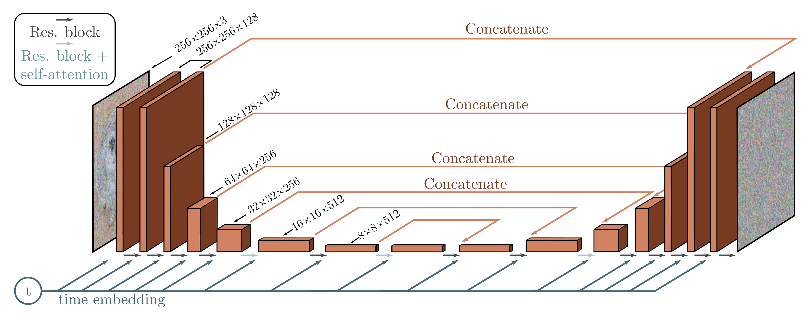

  

  <strong>Figure 18.9</strong> U-Net as used in diffusion models for images. The network aims to predict the noise that was added to the image. It consists of an encoder which reduces the scale and increases the number of channels and a decoder which increases the scale and reduces the number of channels. The encoder representations are concatenated to their partner in the decoder. Connections between adjacent representations consist of residual blocks, and periodic global self-attention in which every spatial position interacts with every other spatial position. A single network is used for all time steps, by passing a sinusoidal time embedding (figure 12.5) through a shallow neural network and adding the result to the channels at every spatial position at every stage of the U-Net.

with this relation, and there is a family of such compatible processes. These are all optimized by the same loss function but have different rules for the forward process and different corresponding rules for how to use the estimated noise  $g[z\_{t}, \phi\_{t}]$  to predict  $z\_{t-1}$  from  $z\_{t}$  in the reverse process (figure 18.10).

Among this family are denoising diffusion implicit models, which are no longer stochastic after the first step from x to  $z\_{1}$ , and accelerated sampling models, where the forward process is defined only on a sub-sequence of time steps. This allows a reverse process that skips time steps and hence makes sampling much more efficient; good samples can be created with 50 time steps when the forward process is no longer stochastic. This is much faster than before but still slower than most other generative models.

## 18.6.3 Conditional generation

If the data has associated labels c, these can be exploited to control the generation. Sometimes this can improve generation results in GANs, and we might expect this to be the case in diffusion models as well; it's easier to denoise an image if you have some information about what that image contains. One approach to conditional synthesis in diffusion models is classifier guidance. This modifies the denoising update from  $z\_{t}$  to  $z\_{t-1}$  to take into account class information c. In practice, this means adding an extra
