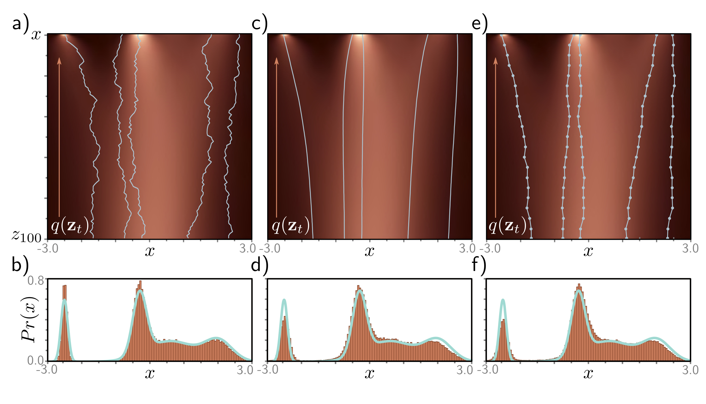

  

  <strong>Figure 18.10</strong> Different diffusion processes that are compatible with the same model. a) Five sampled trajectories of the reparameterized model superimposed on the ground truth marginal distributions. Top row represents $\Pr(\mathbf{x})$ and subsequent rows represent $q(\mathbf{z}_{t}, \cdot)$. b) Histogram of samples generated from the reparameterized model plotted alongside the ground-truth density curve $\Pr(\mathbf{x})$. The same trained model is compatible with a family of diffusion models and corresponding updates in the opposite direction, including the denoising diffusion implicit model (DDIM), which is deterministic and does not add noise at each step. c) Five trajectories from DDIM. d) Histogram of samples from DDIM. The same model is also compatible with accelerated diffusion models that skip inference steps for increased sampling speed. e) Five trajectories from the accelerated model. f) Histogram of samples from the accelerated model.

The classifier-guidance term modifies the final update step in algorithm 18.2 to yield:

$$
\mathbf{z}_{t-1}=\hat{\mathbf{z}}_{t-1}+\sigma_{t}^{2}\frac{\partial\log\left[\Pr(c|\mathbf{z}_{t})\right]}{\partial\mathbf{z}_{t}}+\sigma_{t}\boldsymbol{\epsilon}
\qquad (18.41)
$$

The new term depends on the gradient of a classifier $\Pr(c|\mathbf{z}_{t})$ that is based on the latent variable $\mathbf{z}_{t}$. This maps features from the downsampling half of the U-Net to the class $c$. Like the U-Net, it is usually shared across all time steps and takes time as an input. The update from $\mathbf{z}_{t}$ to $\mathbf{z}_{t-1}$ now makes the class $c$ more likely.

Classifier-free guidance avoids learning a separate classifier $\Pr(c|\mathbf{z}_{t})$ but instead incorporates class information into the main model $\mathbf{g}_{t}[\mathbf{z}_{t},\phi_{t},c]$. In practice, this usually takes the form of adding an embedding based on $c$ to the layers of the U-Net in a similar way to how the time step is added (see figure 18.9). This model is jointly trained on conditional and unconditional objectives by randomly dropping the class information.
