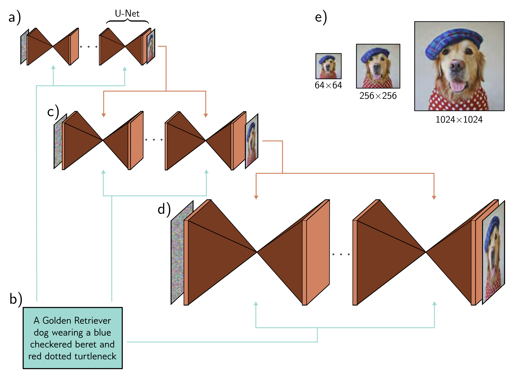

  

  <strong>Figure 18.11</strong> Cascaded conditional generation based on a text prompt. a) A diffusion model consisting of a series of U-Nets is used to generate a $64 \times 64$ image. b) This generation is conditioned on a sentence embedding computed by a language model. c) A higher resolution $256 \times 256$ image is generated and conditioned on the smaller image and the text encoding. d) This is repeated to create a $1024 \times 1024$ image. e) Final image sequence. Adapted from Saharia et al. (2022b).

during training. Hence, it can both generate unconditional or conditional data examples at test time or any weighted combination of the two. This brings a surprising advantage; if the conditioning information is over-weighted, the model tends to produce very high quality but slightly stereotypical examples. This is somewhat analogous to the use of truncation in GANs (figure 15.10).

## 18.6.4 Improving generation quality

As for other generative models, the highest quality results result from applying a combination of tricks and extensions to the basic model. First, it's been noted that it also helps to estimate the variances $\sigma_{t}^{2}$ of the reverse process as well as the mean (i.e., the widths
