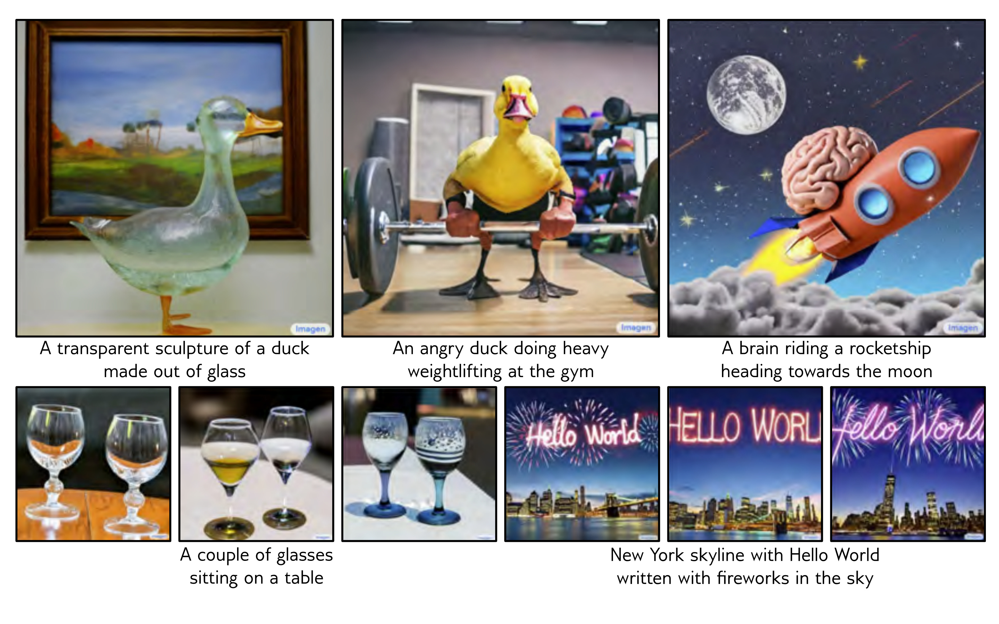
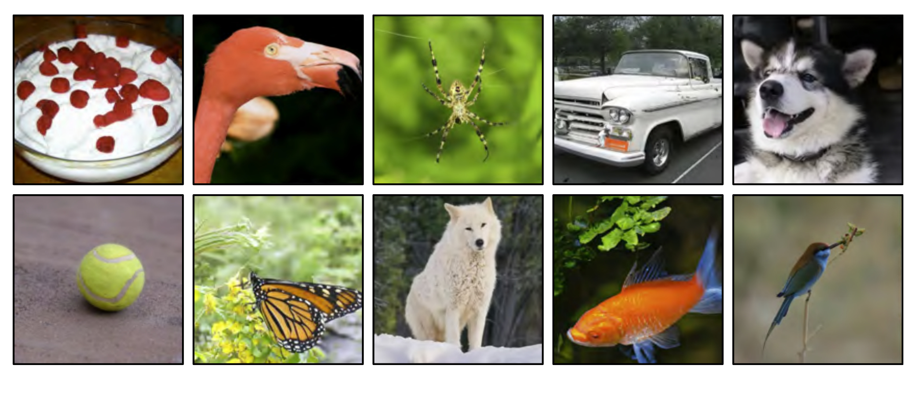
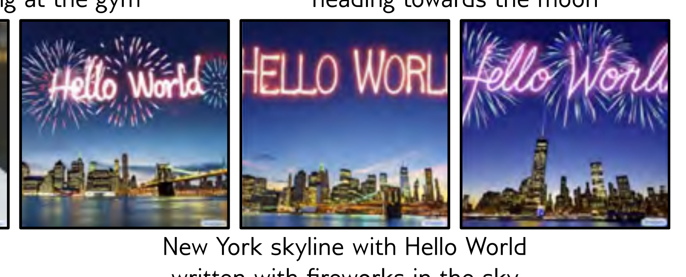

  

  <strong>Figure 18.12</strong> Conditional generation using classifier guidance. Image samples conditioned on different ImageNet classes. The same model produces high quality samples of highly varied image classes. Adapted from Dhariwal & Nichol (2021).

  

  <strong>Figure 18.13</strong> Conditional generation using text prompts. Upper examples from a cascaded generation framework conditioned on text prompts.

  

  <strong>Figure 18.13</strong> Conditional generation using text prompts. Synthesized images from a cascaded generation framework, conditioned on a text prompt encoded by a large language model. The stochastic model can produce many different images compatible with the prompt. The model can count objects and incorporate text into images. Adapted from Saharia et al. (2022b).

