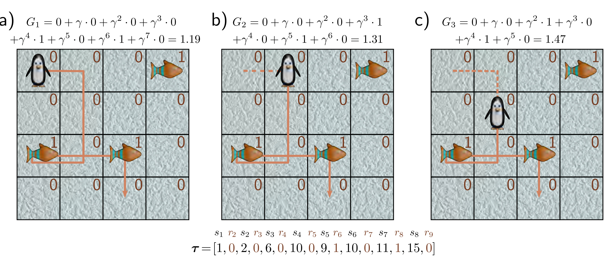
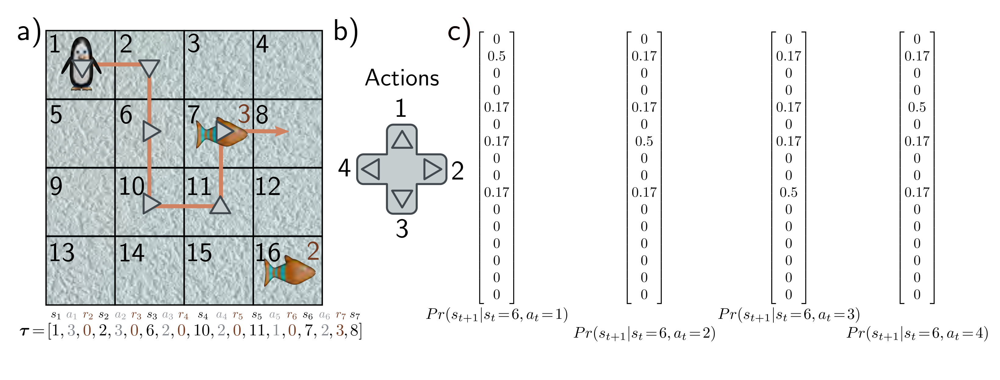

  

  <strong>Figure 19.2</strong> Markov reward process. This associates a distribution $\Pr(r_{t+1}\mid s_t)$ of rewards $r_{t+1}$ with each state $s_t$. a) Here, the rewards are deterministic; the penguin will receive a reward of +1 if it lands on a fish and 0 otherwise. The trajectory $\tau$ now consists of a sequence $s_1, r_2, s_2, r_3, s_3, r_4, \ldots$ of alternating states and rewards, terminating after eight steps. The return $G_t$ of the sequence is the sum of discounted future rewards, here with discount factor $\gamma = 0.9$. b-c) As the penguin proceeds along the trajectory and gets closer to reaching the rewards, the return increases.

  

  <strong>Figure 19.3</strong> Markov decision process. a) The agent can perform one of a set of actions in each state. b) Here, the four actions correspond to moving up, right, down, and left. c) For any state (here, state 6), the action changes the probability of moving to the next state. The penguin moves in the intended direction with 50% probability, but the ice is slippery, so it may slide to one of the other adjacent positions with equal probability. Accordingly, in panel (a), the action taken (gray arrows) does not always line up with the trajectory (orange line). In general, the action can also influence the probability of receiving rewards, but in this example the reward is the same regardless of the action, so $\Pr(r_{t+1}\mid s_t,a_t)=\Pr(r_{t+1}\mid s_t)$. The trajectory $\tau$ from an MDP consists of a sequence $s_1, a_1, r_2, s_2, a_2, r_3, a_3, r_4, \ldots$ of alternating states $s_t$, actions $a_t$, and rewards $r_{t+1}$. Note that here the penguin receives the reward when it leaves a state with a fish (i.e., the reward is received for passing through the fish square, regardless of whether the penguin arrived there intentionally or not).

b) $G_{2}=0+\gamma\cdot0+\gamma^{2}\cdot0+\gamma^{3}\cdot1$ $+\gamma^{4}\cdot0+\gamma^{5}\cdot1+\gamma^{6}\cdot0=1.31$

$$
\tau=[1,0,2,0,6,0,10,0,9,1,10,0,11,1,15,0]
$$

c) $G_{3}=0+\gamma\cdot0+\gamma^{2}\cdot1+\gamma^{3}\cdot0$ $+\gamma^{4}\cdot1+\gamma^{5}\cdot0=1.47$

$s_{1}$   $r_{2}$   $s_{2}$   $r_{3}$   $s_{3}$   $r_{4}$   $s_{4}$   $r_{5}$   $s_{5}$   $r_{6}$   $s_{6}$   $r_{7}$   $s_{7}$   $r_{8}$   $s_{8}$   $r_{9}$

$$
\tau=[1,0,2,0,6,0,10,0,9,1,10,0,11,1,15,0]
$$

$$
\tau=[1,3,0,2,3,0,6,2,0,10,2,0,11,1,0,7,2,3,8]
$$
