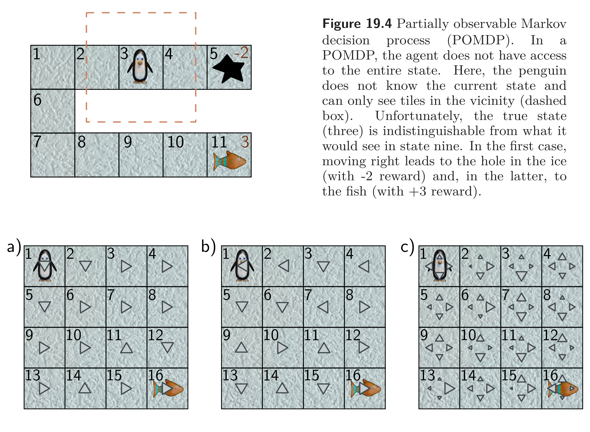

  

  <strong>Figure 19.4</strong> and <strong>Figure 19.5</strong> Partially observable states and policies. Figure 19.4 shows a POMDP where the agent can only see nearby tiles, making state 3 indistinguishable from state 9. Figure 19.5 compares deterministic and stochastic policies; stochastic policies can explore states more thoroughly and can be necessary for optimal performance in partially observable Markov decision processes.

  

  <strong>Figure 19.6</strong> Reinforcement learning loop. The agent takes an action $a\_t$ at time $t$ based on the state $s\_t$, according to the policy $\pi[a\_t\mid s\_t]$. This triggers the generation of a new state $s\_{t+1}$ via the state transition function and a reward $r\_{t+1}$ via the reward function. Both are passed back to the agent, which then chooses a new action.

