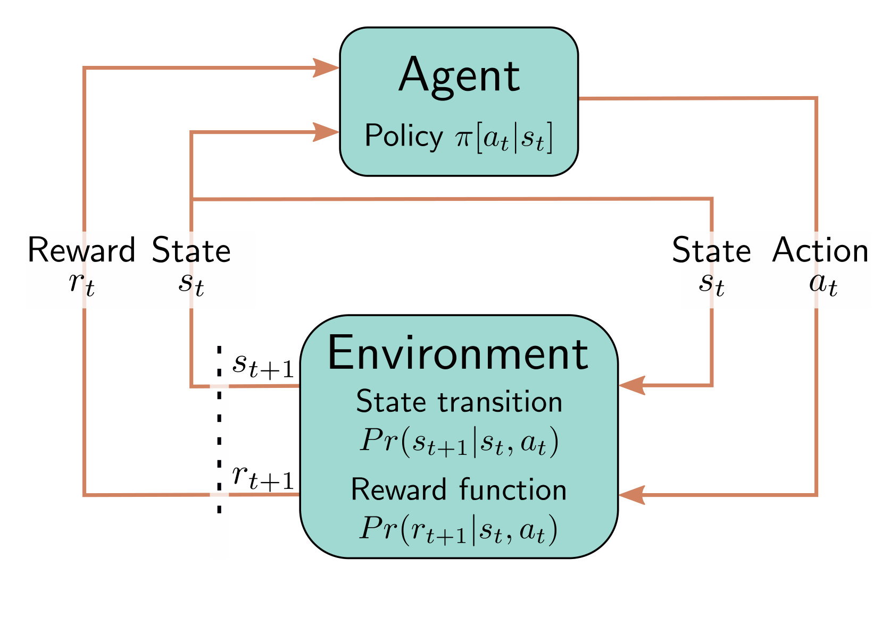

**Figure 1**

  

<strong>Figure 19.4</strong> Partially observable Markov decision process (POMDP). In a POMDP, the agent does not have access to the entire state. Here, the penguin does not know the current state and can only see tiles in the vicinity (dashed box). Unfortunately, the true state (three) is indistinguishable from what it would see in state nine. In the first case, moving right leads to the hole in the ice (with -2 reward) and, in the latter, to the fish (with +3 reward).

a)

  

<strong>Figure 19.5</strong> Policies. a) A deterministic policy always chooses the same action in each state (indicated by arrow). Some policies are better than others. This policy is not optimal but still generally steers the penguin from top-left to bottom-right where the reward lies. b) This policy is more random. c) A stochastic policy has a probability distribution over actions for each state (probability indicated by size of arrows). This has the advantage that the agent explores the states more thoroughly and can be necessary for optimal performance in partially observable Markov decision processes.

b)

c)

Draft: please send errata to udlbookmail@gmail.com.
