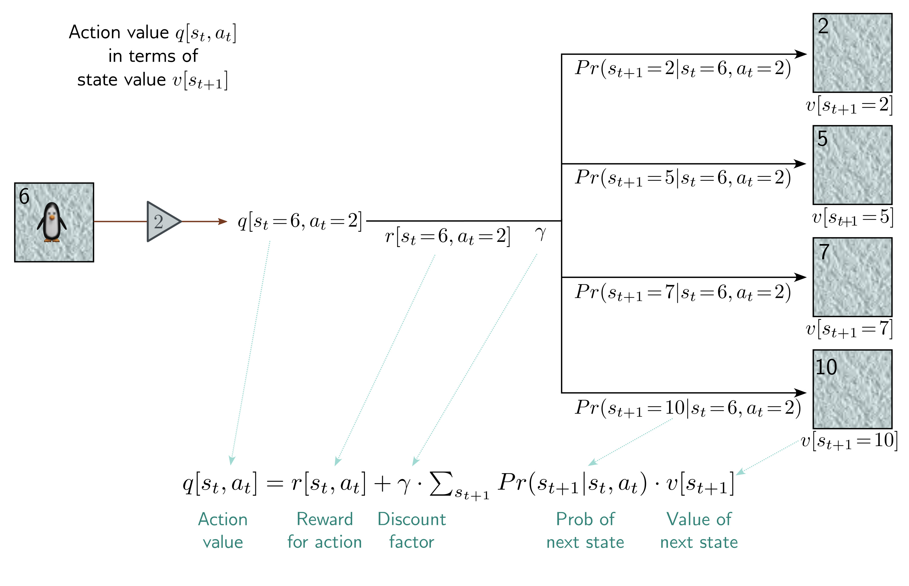
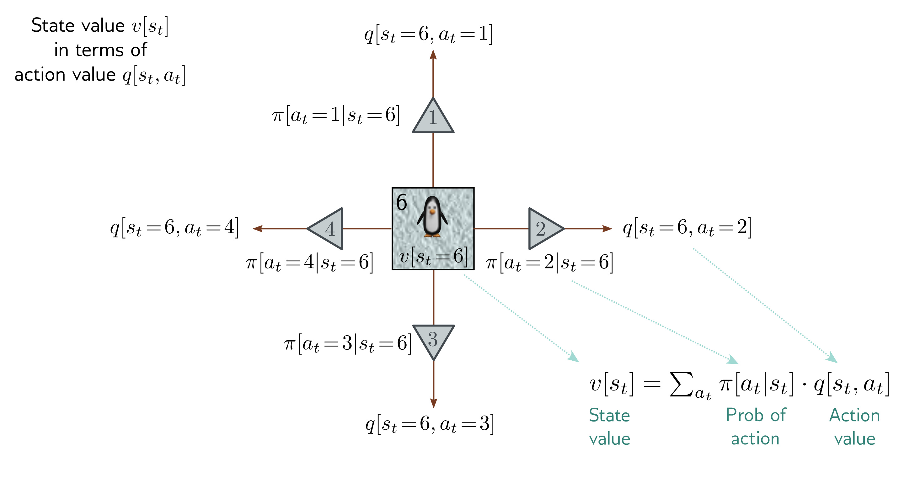

  

<strong>Figure 19.8</strong> Relationship between state values and action values. The value of state six v[s_{t}=6] is a weighted sum of the action values q[s_{t}=6, a_{t}] at state six, where the weights are the policy probabilities $\pi[a_{t}|s_{t}=6]$ of taking that action.

  

<strong>Figure 19.9</strong> Relationship between action values and state values. The value q[s_{t}=6, a_{t}=2] of taking action two in state six is the reward r[s_{t}=6, a_{t}=2] from taking that action plus a weighted sum of the discounted values v[s_{t+1}] of being in successor states, where the weights are the transition probabilities Pr(s_{t+1}|s_{t}=6, a_{t}=2). The Bellman equations chain this relation with that of figure 19.8 to link the current and next (i) state values and (ii) action values.

Draft: please send errata to udlbookmail@gmail.com.
