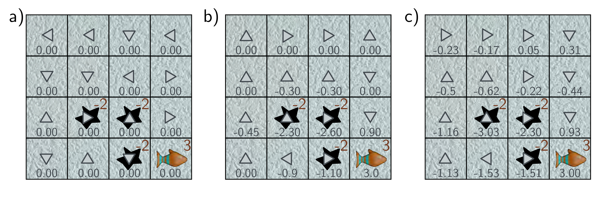

  

  <strong>Figure 19.10</strong> Dynamic programming. a) The state values are initialized to zero, and the policy (arrows) is chosen randomly. b) The state values are updated to be consistent with their neighbors (equation 19.11, shown after two iterations). The policy is updated to move the agent to states with the highest value (equation 19.12). c) After several iterations, the algorithm converges to the optimal policy, in which the penguin tries to avoid the holes and reach the fish.

## 19.3.1 Dynamic programming

Dynamic programming algorithms assume we have perfect knowledge of the transition and reward structure. In this respect, they are distinguished from most RL algorithms which observe the agent interacting with the environment to gather information about these quantities indirectly.

The state values  $v[s]$  are initialized arbitrarily (usually to zero). The deterministic policy  $\pi[a|s]$  is also initialized (e.g., by choosing a random action for each state). The algorithm then alternates between iteratively computing the state values for the current policy (policy evaluation) and improving that policy (policy improvement).

Policy evaluation: We sweep through the states $s\_{t}$, updating their values:

$$
v[s_{t}]\leftarrow\sum_{a_{t}}\pi[a_{t}|s_{t}]\left(r[s_{t},a_{t}]+\gamma\cdot\sum_{s_{t+1}}\Pr(s_{t+1}|s_{t},a_{t})v[s_{t+1}]\right), \quad (19.11)
$$

where  $s\_{t+1}$  is the successor state and  $\Pr(s\_{t+1}|s\_t, a\_t)$  is the state transition probability. Each update makes  $v[s\_t]$  consistent with the value at the successor state  $s\_{t+1}$  using the Bellman equation for state values (equation 19.9). This is termed bootstrapping.

Policy improvement: To update the policy, we greedily choose the action that maximizes the value for each state:

$$
\pi[a_{t}|s_{t}]\leftarrow\underset{a_{t}}{\mathop{\mathrm{argmax}}}\Bigg[r[s_{t},a_{t}]+\gamma\cdot\sum_{s_{t+1}}\Pr(s_{t+1}|s_{t},a_{t})v[s_{t+1}]\Bigg]. \quad (19.12)
$$

This is guaranteed to improve the policy according to the policy improvement theorem.
