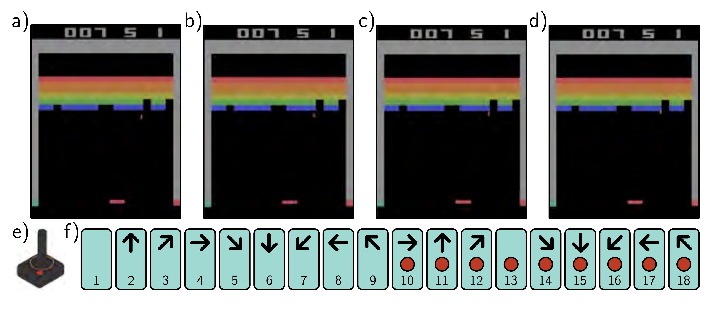

  

  <strong>Figure 19.13</strong> Atari Benchmark. The Atari benchmark consists of 49 Atari 2600 games, including Breakout (pictured), Pong, and various shoot-em-up, platform, and other types of games. a-d) Even for games with a single screen, the state is not fully observable from a single frame because the velocity of the objects is unknown. Consequently, it is usual to use several adjacent frames (here, four) to represent the state. e) The action simulates the user input via a joystick. f) There are eighteen actions corresponding to eight directions of movement or no movement, and for each of these nine cases, the button being pressed or not.

## 19.4.1 Deep Q-networks for playing ATARI games

Deep networks are ideally suited to making predictions from a high-dimensional state space, so they are a natural choice for the model in fitted Q-learning. In principle, they could take both state and action as input and predict the values, but in practice, the network takes only the state and simultaneously predicts the values for each action.

The Deep Q-Network was a breakthrough reinforcement learning architecture that exploited deep networks to learn to play ATARI 2600 games. The observed data comprises  $220 \times 160$  images with 128 possible colors at each pixel (figure 19.13). This was reshaped to size  $84 \times 84$ , and only the brightness value was retained. Unfortunately, the full state is not observable from a single frame. For example, the velocity of game objects is unknown. To help resolve this problem, the network ingests the last four frames at each time step to form  $s_{t}$ . It maps these frames through three convolutional layers followed by a fully connected layer to predict the value of every action (figure 19.14).

Several modifications were made to the standard training procedure. First, the rewards (which were driven by the score in the game) were clipped to -1 for a negative change and +1 for a positive change. This compensates for the wide variation in scores between different games and allows the same learning rate to be used. Second, the system exploited experience replay. Rather than update the network based on the tuple  $\langle s_{t}, a_{t}, r_{t+1}, S_{t+1} \rangle$  at the current step or with a batch of the last I tuples, all recent
