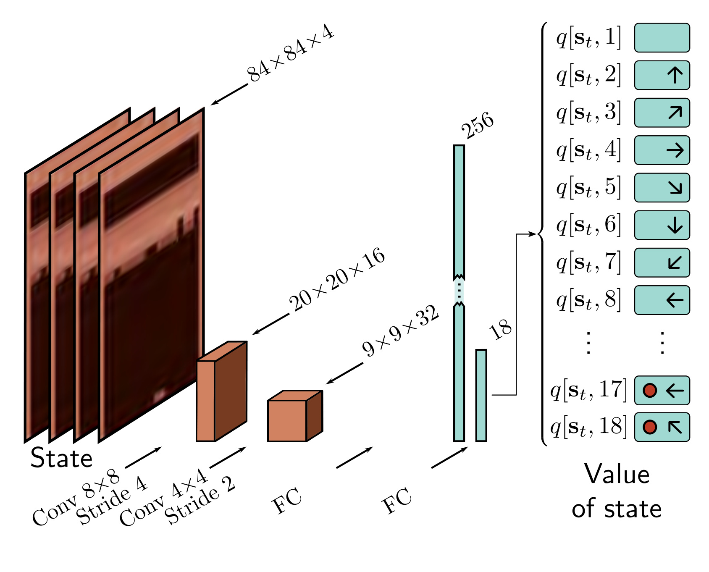

  

  <strong>Figure 19.14</strong> Deep Q-network architecture. The input $s_{t}$ consists of four adjacent frames of the ATARI game. Each is resized to $84 \times 84$ and converted to grayscale. These frames are represented as four channels and processed by an $8 \times 8$ convolution with stride four, followed by a $4 \times 4$ convolution with stride 2, followed by two fully connected layers. The final output predicts the action value $q[s_{t}, a_{t}]$ for each of the 18 actions in this state.

tuples were stored in a buffer. This buffer was sampled randomly to generate a batch at each step. This approach reuses data samples many times and reduces correlations between the samples in the batch that arise due to the similarity of adjacent frames.

Finally, the issue of convergence in fitted Q-Networks was tackled by fixing the target parameters to values  $\phi^{-}$ and only updating them periodically. This gives the update:

$$
\phi\leftarrow\phi+\alpha r\big[s t,a_{t}\big]+\gamma\cdot\max_{a}\Big[q[s_{t+1},a,\phi^{-}]\big]-q[s t,a_{t},\phi\big]. \quad (19.18)
$$

Now the network no longer chases a moving target and is less prone to oscillation.

Using these and other heuristics and with an  $\epsilon$ -greedy policy, Deep Q-Networks performed at a level comparable to a professional game tester across a set of 49 games using the same network architecture (trained separately for each game). It should be noted that the training process was data-intensive. It took around 38 full days of experience to learn each game. In some games, the algorithm exceeded human performance. On other games like “Montezuma’s Revenge,” it barely made any progress. This game features sparse rewards and multiple screens with quite different appearances.

## 19.4.2 Double Q-learning and double deep Q-networks

One potential flaw of Q-Learning is that the maximization over the actions in the update:

$$
q[s_{t},a_{t}]\leftarrow q[s_{t},a_{t}]+\alpha\bigg(r[s_{t},a_{t}]+\gamma\cdot\max_{a}\big[q[s_{t+1},a]\bigg]-q[s_{t},a_{t}]\bigg) \quad (19.19)
$$

leads to a systematic bias in the estimated action values  $q[s_{t},a_{t}]$ . Consider two actions that provide the same average reward, but one is stochastic and the other deterministic. The stochastic reward will exceed the average roughly half of the time and be chosen by the maximum operation, causing the corresponding action value  $q[s_{t},a_{t}]$  to be overestimated. A similar argument can be made about random inaccuracies in the output of the network  $q[s_{t},a_{t},\phi]$  or random initializations of the q-function.
