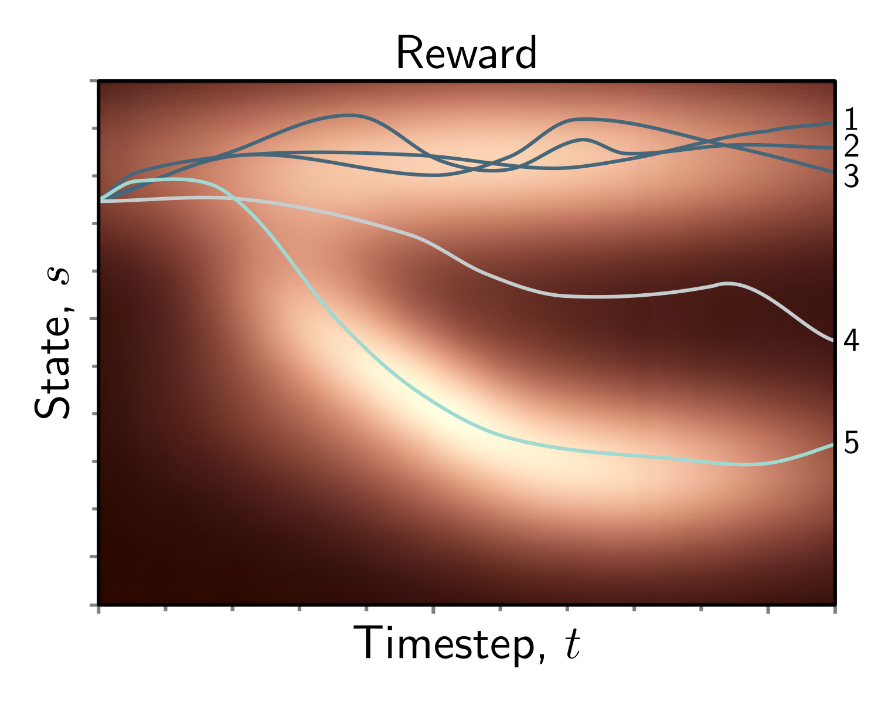

**Figure 1**

  

<strong>Figure 19.15</strong> Policy gradients. Five episodes for the same policy (brighter indicates higher reward). Trajectories 1, 2, and 3 generate consistently high rewards, but similar trajectories already frequently occur with this policy, so there is no need to change. Conversely, trajectory 4 receives low rewards, so the policy should be modified to avoid producing similar trajectories. Trajectory 5 receives high rewards and is unusual. This will cause the largest change to the policy under equation 19.25.

$$
\begin{aligned}
\frac{\partial\log[f[z]}{\partial z}=\frac{1}{f[z]}\frac{\partial f[z]}{\partial z}, \tag{19.26}
\end{aligned}
$$

which yields the update:

$$
\begin{aligned}
\boldsymbol{\theta}\leftarrow\boldsymbol{\theta}+\alpha\cdot\frac{1}{I}\sum_{i=1}^{I}\frac{\partial\log\left[P r(\boldsymbol{\tau}_{i}|\boldsymbol{\theta})\right]}{\partial\boldsymbol{\theta}}r[\boldsymbol{\tau}_{i}]. \tag{19.27}
\end{aligned}
$$

The log probability $\log[Pr(\tau|\theta)]$ of a trajectory is given by:

$$
\begin{aligned}
\begin{align*}\log[Pr(\boldsymbol{\tau}|\boldsymbol{\theta})]\quad&=\quad\log\left[Pr(\mathbf{s}_{1})\prod_{t=1}^{T}\pi[a_{t}|\mathbf{s}_{t},\boldsymbol{\theta}]Pr(\mathbf{s}_{t+1}|\mathbf{s}_{t},a_{t})\right]\\&=\quad\log\left[Pr(\mathbf{s}_{1})\right]+\sum_{t=1}^{T}\log\left[\pi[a_{t}|\mathbf{s}_{t},\boldsymbol{\theta}]\right]+\sum_{t=1}^{T}\log\left[Pr(\mathbf{s}_{t+1}|\mathbf{s}_{t},a_{t})\right],\end{align*} \tag{19.28}
\end{aligned}
$$

and noting that only the center term depends on $\theta$, we can rewrite the update from equation 19.27 as:

$$
\begin{aligned}
\boldsymbol{\theta}\leftarrow\boldsymbol{\theta}+\alpha\cdot\frac{1}{I}\sum_{i=1}^{I}\sum_{t=1}^{T}\frac{\partial\log\left[\pi[a_{i t}|\mathbf{s}_{t},\boldsymbol{\theta}]\right]}{\partial\boldsymbol{\theta}}r[\tau_{i}], \tag{19.29}
\end{aligned}
$$

where $\mathbf{s}_{it}$ is the state at time $t$ in episode $i$, and $a_{it}$ is the action taken at time $t$ in episode $i$. Note that the terms relating to the state evolution $\Pr(\mathbf{s}_{t+1}|\mathbf{s}_t,a_t)$ disappear from this formulation. It follows that this parameter update does not assume a Markov time evolution process.

We can further simplify this by noting that:

$$
\begin{aligned}
\tau[\boldsymbol{\tau}_{i}]=\sum_{t=1}^{T}r_{i,t+1}=\sum_{k=1}^{t}r_{i,k+1}+\sum_{k=t}^{T}r_{i,k+1}, \tag{19.30}
\end{aligned}
$$

Draft: please send errata to udlbookmail@gmail.com.
