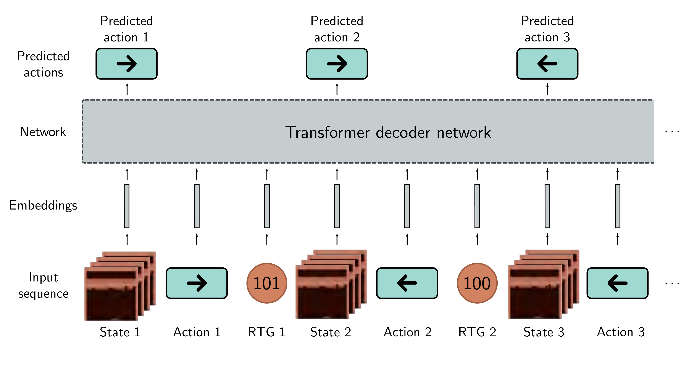

  

  <strong>Figure 19.17</strong> Decision transformer. The decision transformer treats offline reinforcement learning as a sequence prediction task. The input is a sequence of states, actions, and returns-to-go (remaining rewards in the episode), each of which is mapped to a fixed-size embedding. At each time step, the network predicts the next action. During testing, the returns-to-go are unknown; in practice, an initial estimate is made from which subsequent observed rewards are subtracted.

the critic, with two sets of outputs that predict the policy and the values, respectively. Note that although actor-critic methods can update the policy parameters at each step, this is rarely done in practice. The agent typically collects a batch of experience over many time steps before the policy is updated.

## 19.7 Offline reinforcement learning

Interaction with the environment is at the core of reinforcement learning. However, there are some scenarios where it is not practical to send a naive agent into an environment to explore the effect of different actions. This may be because erratic behavior in the environment is dangerous (e.g., driving autonomous vehicles) or because data collection is time-consuming or expensive (e.g., making financial trades).

However, it is possible to gather historical data from human agents in both cases. Offline RL or batch RL aims to learn how to take actions that maximize rewards on future episodes by observing past sequences  $s_{1}, a_{1}, r_{2}, s_{2}, a_{2}, r_{3}, \ldots$ , without ever interacting with the environment. It is distinct from imitation learning, a related technique that (i) does not have access to the rewards and (ii) attempts to replicate the performance of a historical agent rather than improve it.

Although there are offline RL methods based on Q-Learning and policy gradients,
