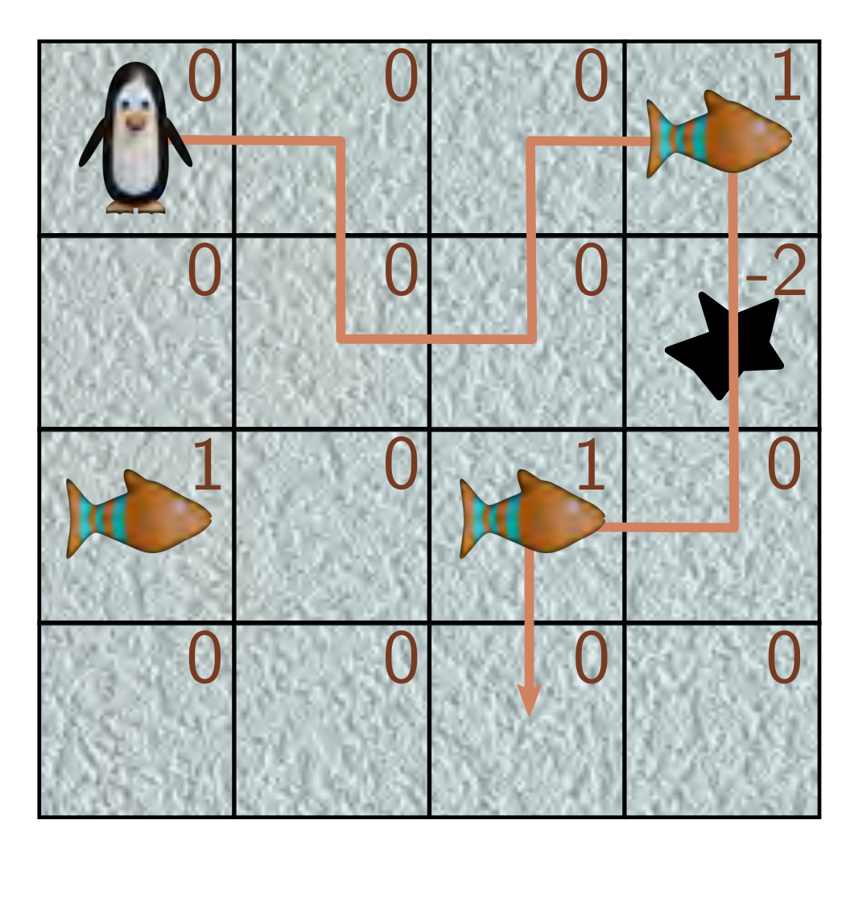

  

<strong>Figure 19.18</strong> One trajectory through an MRP. The penguin receives a reward of +1 when it reaches the first fish tile, -2 when it falls in the hole, and +1 for reaching the second fish tile. The discount factor $\gamma$ is 0.9.

Problem 19.6 Show that:

$$
\begin{aligned}
\mathbb{E}_{\tau}\left[\frac{\partial}{\partial\theta}\log[Pr(\boldsymbol{\tau}|\theta)]b\right]=0,
\end{aligned}
\tag{19.48}
$$

where b does not depend on $\tau$, so adding a baseline update doesn’t change the expected policy gradient update.

Problem 19.7 $^{*}$ Suppose that we want to estimate a quantity E[a] from samples $a_{1}, a_{2} \ldots a_{I}$ . Consider that we also have paired samples $b_{1}, b_{2} \ldots b_{I}$ that are samples that co-vary with a where E[b] = $\mu_{b}$ . We define a new variable:

$$
\begin{aligned}
a^{\prime}=a-c(b-\mu_{b}).
\end{aligned}
\tag{19.49}
$$

Show that $\mathrm{Var}[a']\leq\mathrm{Var}[a]$ when the constant c is chosen judiciously. Find an expression for the optimal value of c.

Problem 19.8 The estimate of the gradient in equation 19.34 can be written as:

$$
\begin{aligned}
\mathbb{E}_{\tau}\left[\mathbf{g}[\boldsymbol{\theta}](r[\pmb{\tau}_{t}]-\boldsymbol{b})\right],
\end{aligned}
\tag{19.50}
$$

where

$$
\begin{aligned}
\mathbf{g}[\boldsymbol{\theta},\tau]=\sum_{k=t}^{T}\frac{\partial\log\left[Pr(a_{t}|\mathbf{s}_{t},\boldsymbol{\theta})\right]}{\partial\boldsymbol{\theta}},
\end{aligned}
\tag{19.51}
$$

and

$$
\begin{aligned}
r[\pmb{\tau}]=\sum_{k=t}^{T}r_{k}.
\end{aligned}
\tag{19.52}
$$

Show that the value of b that minimizes the variance of the gradient estimate is given by:

$$
\begin{aligned}
b=\frac{\mathbb{E}\left[\mathbf{g}[\boldsymbol{\theta},\tau]^{2}r[\pmb{\tau}]\right]}{\mathbb{E}\left[\mathbf{g}[\boldsymbol{\theta},\tau]^{2}\right]}.
\end{aligned}
\tag{19.53}
$$

You will need to use the result from equation 19.35.

Draft: please send errata to udlbookmail@gmail.com.
