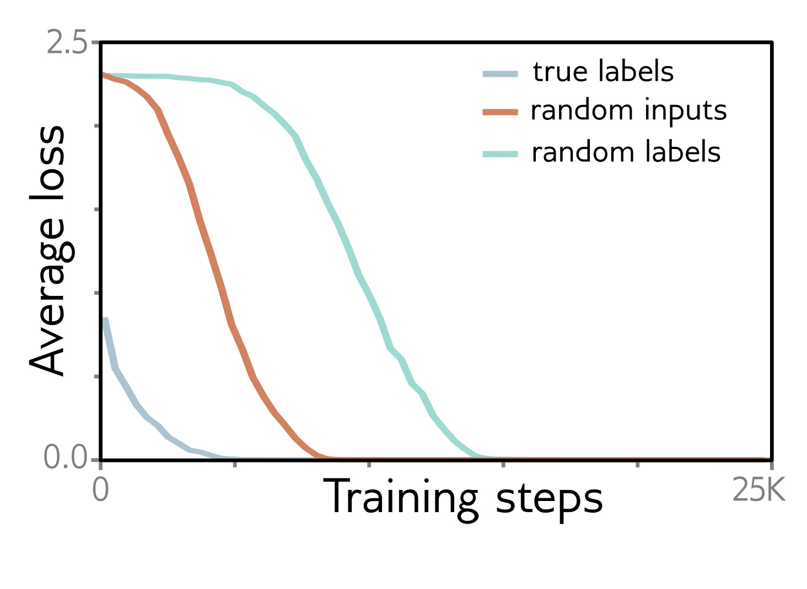

  

  <strong>Figure 20.1</strong> Fitting random data. Losses for AlexNet architecture trained on CIFAR-10 dataset with SGD. When the pixels are drawn from a Gaussian random distribution with the same mean and variance as the original image dataset, the model can still be fit (albeit more slowly). When the labels are randomized, the model can still be fit (albeit even more slowly). Adapted from Zhang et al. (2017a).

## 20.2.1 Dataset

It’s important to realize that we can’t learn any function. Consider a completely random mapping from every possible  $28 \times 28$  binary image to one of ten categories. Since there is no structure to this function, the only recourse is to memorize the  $2^{784}$  assignments. However, it’s easy to train a model on the MNIST dataset (figures 8.10 and 15.15), which contains 60,000 examples of  $28 \times 28$  images labeled with one of ten categories. One explanation for this contradiction could be that it is easy to find global minima because the real-world functions that we approximate are relatively simple. [^1]

This hypothesis was investigated by Zhang et al. (2017a), who trained AlexNet on the CIFAR-10 image classification dataset (which has 50,000 examples of  $32 \times 32 \times 3$  images labeled with one of 10 classes) when (i) each image was replaced with Gaussian noise and (ii) the labels of the ten classes were randomly permuted (figure 20.1). These changes slowed down learning, but the network could still fit this finite dataset well. This suggests that the properties of the dataset aren’t critical.

## 20.2.2 Regularization

Another possible explanation for the ease with which models are trained is that some regularization methods like L2 regularization (weight decay) make the loss surface flatter and more convex. However, Zhang et al. (2017a) found that neither L2 regularization nor Dropout was required to fit random data. This does not eliminate implicit regularization due to the finite step size of the fitting algorithms (section 9.2). However, this effect increases with the learning rate (equation 9.9), and model-fitting does not get easier with larger learning rates.

## 20.2.3 Stochastic training algorithms

Chapter 6 argued that the SGD algorithm potentially allows the optimization trajectory to move between “valleys” during training. However, Keskar et al. (2017) show that
