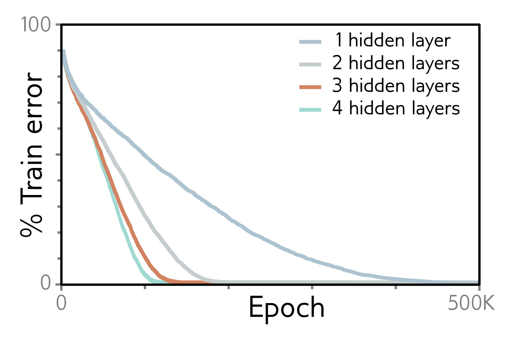

**Figure 1**

  

<strong>Figure 20.2</strong> MNIST-1D training. Four fully connected networks were fit to 4000 MNIST-1D examples with random labels using full batch gradient descent, He initialization, no momentum or regularization, and learning rate (0.0025). Models with 1,2,3,4 layers had 298, 100, 75, and 63 hidden units per layer and 15208, 15210, 15235, and 15139 parameters, respectively. All models train successfully, but deeper models require fewer epochs.

several models (including fully connected and convolutional networks) can be fit to many datasets (including CIFAR-100 and MNIST) almost perfectly with very large batches of 5000-6000 images. This eliminates most of the randomness but training still succeeds.

Figure 20.2 shows training results for four fully connected models fitted to 4000 MNIST-1D examples with randomized labels using full-batch (i.e., non-stochastic) gradient descent. There was no explicit regularization, and the learning rate was set to a small constant value of 0.0025 to minimize implicit regularization. Here, the true mapping from data to labels has no structure, the training is deterministic, and there is no regularization, and yet the training error still decreases to zero. This suggests that these loss functions may genuinely have no local minima.

## 20.2.4 Overparameterization

Overparameterization almost certainly is an important factor that contributes to ease of training. It implies that there is a large family of degenerate solutions, so there may always be a direction in which the parameters can be modified to decrease the loss. Sejnowski (2020) suggests that “… the degeneracy of solutions changes the nature of the problem from finding a needle in a haystack to a haystack of needles.”

In practice, networks are frequently overparameterized by one or two orders of magnitude (figure 20.3). However, data augmentation makes it difficult to make precise statements. Augmentation may increase the data by several orders of magnitude, but these are manipulations of existing examples rather than independent new data points. Moreover, figure 8.10 shows that neural networks can sometimes fit the training data well when there are the same number or fewer parameters than data points. This is presumably due to redundancy in training examples from the same underlying function.

Several theoretical convergence results show that, under certain circumstances, SGD converges to a global minimum when the network is sufficiently overparameterized. For these are manipulations of existing examples rather than independent new data points. Moreover, figure 8.10 shows that neural networks can sometimes fit the training data well when there are the same number or fewer parameters than data points. This is presumably due to redundancy in training examples from the same underlying function.

Draft: please send errata to udlbookmail@gmail.com.
