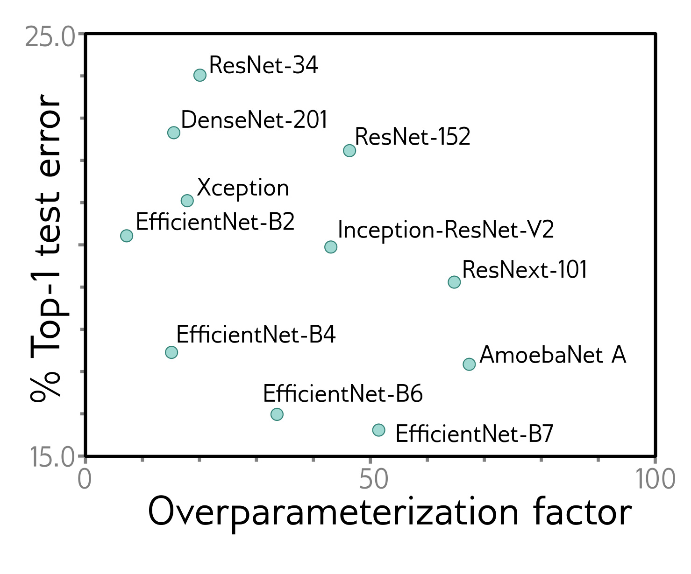

  

  <strong>Figure 20.3</strong> Overparameterization. ImageNet performance for convolutional nets as a function of overparameterization (in multiples of dataset size). Most models have 100–100 times more parameters than the one where training examples. Models compared are ResNet (He et al., 2016a,b), DenseNet (Huang et al., 2017b), Xception (Chollet, 2017), EfficientNet (Tan & Le, 2019), Inception (Szegedy et al., 2017), ResNeXt (Xie et al., 2017), and AmoebaNet (Cubuk et al., 2019).

If a neural network is sufficiently overparameterized so that it can memorize any dataset of a fixed size, then all stationary points become global minima (Livni et al., 2014; Nguyen & Hein, 2017, 2018). Other results show that if the network is wide enough, local minima where the loss is higher than the global minimum are rare (see Choromanska et al., 2015; Pascanu et al., 2014; Pennington & Bahri, 2017). Kawaguchi et al. (2019) prove that as a network becomes deeper, wider, or both, the loss at local minima becomes closer to that at the global minimum for squared loss functions.

These theoretical results are intriguing but usually make unrealistic assumptions about the network structure. For example, Du et al. (2019a) show that residual networks converge to zero training loss when the width of the network D (i.e., the number of hidden units) is  $\Omega[I^{4}K^{2}]$  where I is the amount of training data, and K is the depth of the network. Similarly, Nguyen & Hein (2017) assume that the network’s width is larger than the dataset size, which is unrealistic in most practical scenarios. Overparameterization seems to be important, but theory cannot yet explain empirical fitting performance.

## 20.2.5 Activation functions

The activation function is also known to affect training difficulty. Networks where the activation only changes over a small part of the input range are harder to fit than ReLUs (which vary over half the input range) or Leaky ReLUs (which vary over the full range); For example, sigmoid and tanh nonlinearities (figure 3.13a) have shallow gradients in their tails; where the activation function is near-constant, the training gradient is near-zero, so the mechanism to improve the model is extremely weak.

## 20.2.6 Initialization

Another potential explanation is that Xavier/He initialization sets the parameters to values that are easy to optimize. Of course, for deeper networks, such initialization is necessary to avoid exploding and vanishing gradients, so in a trivial sense, initialisation is critical to training success. However, for shallower networks, the initial variance of the
