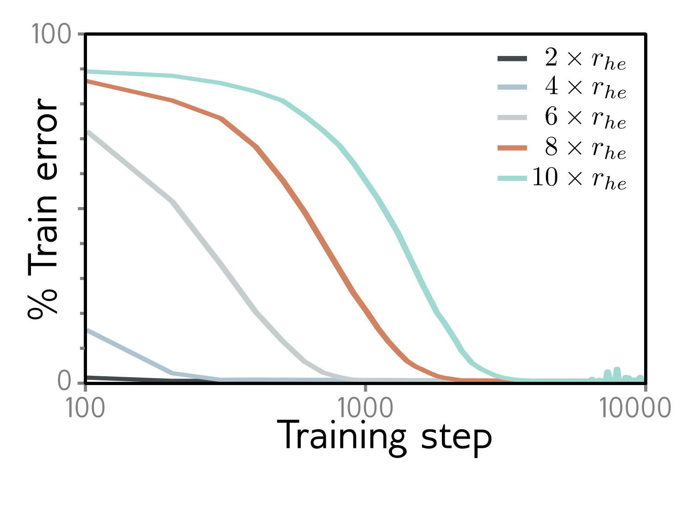

**Figure 1**

  

<strong>Figure 20.4</strong> Initialization and fitting. A three-layer fully connected network with 200 hidden units per layer was trained on 1000 MNIST examples with AdamW using one-hot targets and mean-squared error loss. It takes longer to fit networks when larger multiples of He initialization are used, but this doesn’t change the outcome. This may simply reflect the extra distance that the weights must move. Adapted from Liu et al. (2023c).

weights is less important. Liu et al. (2023c) trained a 3-layer fully connected network with 200 hidden units per layer on 1000 MNIST data points. They found that more iterations were required to fit the training data as the variance increased from that proposed by He (figure 20.4), but this did not ultimately impede fitting. Hence, initialization doesn’t shed much light on why fitting neural networks is easy, although exploding/vanishing gradients do reveal initializations that make training difficult with finite precision arithmetic.

## 20.2.7 Network depth

Neural networks are harder to fit when the depth becomes very large due to exploding and vanishing gradients (figure 7.7) and shattered gradients (figure 11.3). However, these are (arguably) practical numerical issues. There is no definitive evidence that the underlying loss function is fundamentally more or less convex as the network depth increases. Figure 20.2 does show that for MNIST data with randomized labels and He initialization, deeper networks train in fewer iterations. However, this might be because either (i) the gradients in deeper networks are steeper or (ii) He initialization just starts wider, shallower networks further away from the optimal parameters.

Frankle & Carbin (2019) show that for small networks like VGG, you can get the same or better performance if you (i) train the network, (ii) prune the weights with the smallest magnitudes and (iii) retrain from the same initial weights. This does not work if the weights are randomly re-initialized. They concluded that the original overparameterized network contains small trainable sub-networks, which are sufficient to provide the performance. They term this the lottery ticket hypothesis and denote the sub-networks as winning tickets. This suggests that the effective number of sub-networks may have a key role to play in fitting. This (perhaps) varies with the network depth for a fixed parameter count, but a precise characterization of this idea is lacking.

## 20.3 Properties of loss functions

The previous section discussed factors that contribute to the ease with which neural networks can be trained. The number of parameters (degree of overparameterization) and
