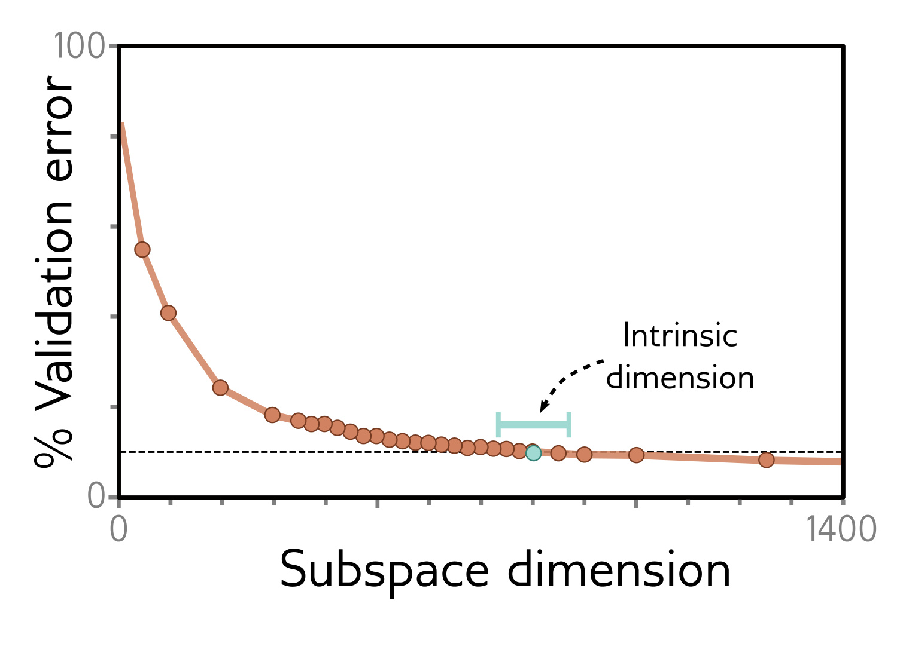
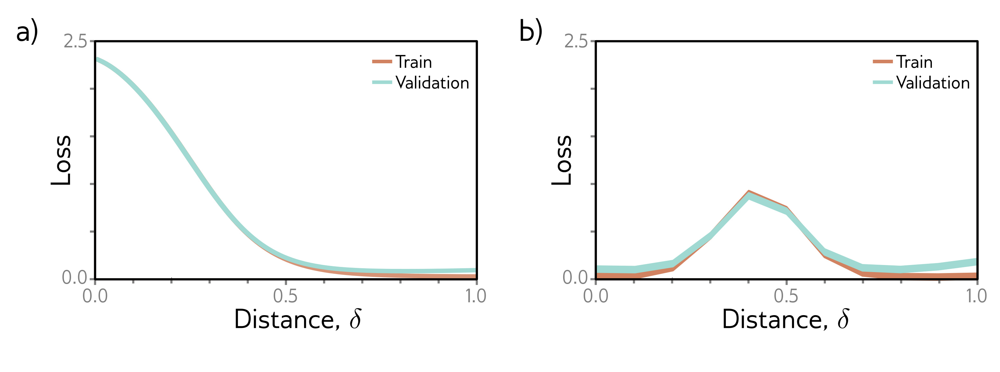

  

<strong>Figure 20.5</strong> Linear slices through loss function. a) A two-layer fully connected ReLU network is trained on MNIST. The loss along a straight line starting at the initial parameters ( $\delta=0$ ) and finishing at the trained parameters ( $\delta=1$ ) descends monotonically. b) However, in this two-layer fully connected MaxOut network on MNIST, there is an increase in the loss along a straight line between one solution ( $\delta=0$ ) and another ( $\delta=1$ ). Adapted from Goodfellow et al. (2015b).

b)

  

<strong>Figure 20.6</strong> Subspace training. A fully connected network with two hidden layers, each with 200 units was trained on MNIST. Parameters were initialized using a standard method but then constrained to lie within a random subspace. Performance reaches 90% of the unconstrained level when this subspace is 750D (termed the intrinsic dimension), which is 0.4% of the original parameters. Adapted from Li et al. (2018a).

between them (figure 20.5b); good minima are not generally linearly connected. However, Frankle et al. (2020) showed that this increase vanishes if the networks are identically trained initially and later allowed to diverge by using different SGD noise and augmentation. This suggests that the solution is constrained early in training and that some families of minima are linearly connected.

Draxler et al. (2018) found minima with good (but different) performance on the CIFAR-10 dataset. They then showed that it is possible to construct paths from one to the other, where the loss function remains low along this path. They conclude that there is a single connected manifold of low loss (figure 20.7). This seems to be increasingly true as the width and depth of the network increase. Garipov et al. (2018) and Fort & Jastrzębski (2019) present other schemes for connecting minima.
