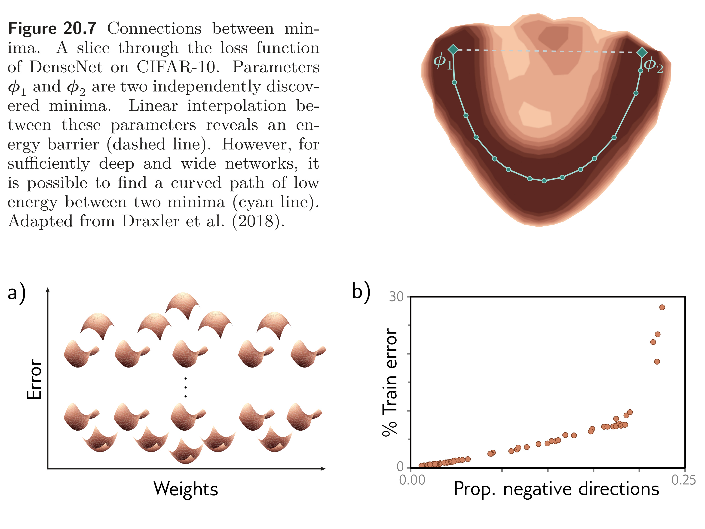
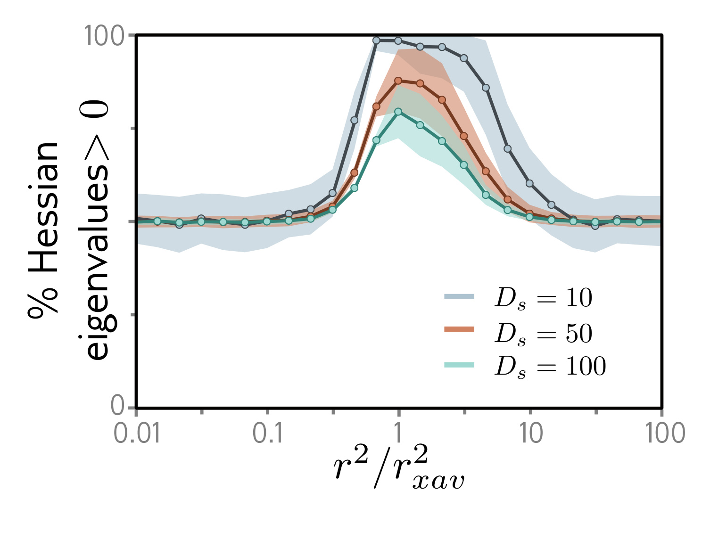

  

  <strong>Figure 20.7</strong> and <strong>Figure 20.8</strong> Loss-surface structure. Figure 20.7 shows that for sufficiently deep and wide networks, a curved low-energy path can connect two independently discovered minima. Figure 20.8 shows that, in random Gaussian functions and neural network loss surfaces, lower-loss critical points tend to have fewer downward-curving directions.

  

  <strong>Figure 20.9</strong> Goldilocks zone. The proportion of Hessian eigenvalues that are greater than zero in a random subspace of dimension $D_s$ is plotted against squared parameter radius relative to Xavier initialization; a pronounced region of positive curvature is known as the Goldilocks zone. Adapted from Fort & Scherlis (2019).

