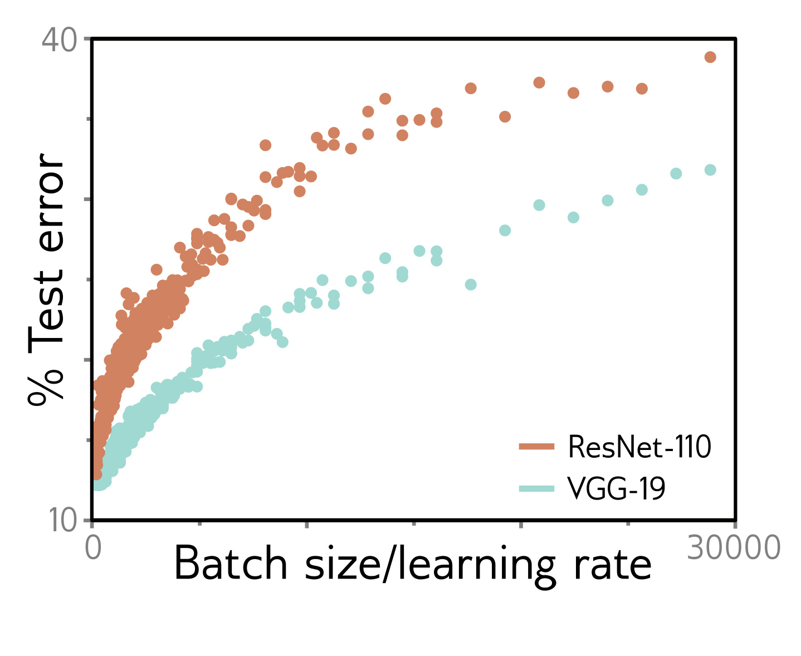

  

  <strong>Figure 20.10</strong> Batch size to learning rate ratio. Generalization of two models on the CIFAR-10 database depends on the ratio of batch size to the learning rate. As the batch size increases, generalization decreases. As the learning rate increases, generalization increases. Adapted from He et al. (2019).

## 20.3.4 Curvature of loss surface

Random Gaussian functions (in which points are jointly distributed with covariance given by a kernel function of their distance) have an interesting property: for points where the gradient is zero, the fraction of directions where the function curves down becomes smaller when these points occur at lower loss values (see Bahri et al., 2020). Dauphin et al. (2014) searched for saddle points in a neural network loss function and similarly found a correlation between the loss and the number of negative eigenvalues (figure 20.8). Baldi & Hornik (1989) analyzed the error surface of a shallow network and found that there were no local minima but only saddle points. These results suggest that there are few or no bad local minima.

Fort & Scherlis (2019) measured the curvature at random points on a neural network loss surface; they showed that the curvature of the surface is unusually positive when the  $\ell\_{2}$  norm of the weights lies within a certain range (figure 20.9), which they term the Goldilocks zone. He and Xavier initialization fall within this range.

## 20.4 Factors that determine generalization

The last two sections considered factors that determine whether the network trains successfully and what is known about neural network loss functions. This section considers factors that determine how well the network generalizes. This complements the discussion of regularization (chapter 9), which explicitly aims to encourage generalization.

## 20.4.1 Training algorithms

Since deep networks are usually overparameterized, the details of the training process determine which of the degenerate family of minima the algorithm converges to. Some of these details reliably improve generalization.

LeCun et al. (2012) show that SGD generalizes better than full-batch gradient descent. It has been argued that SGD generalizes better than Adam (e.g., Wilson et al., 2017; Keskar & Socher, 2017), but more recent studies suggest that there is little dif-
