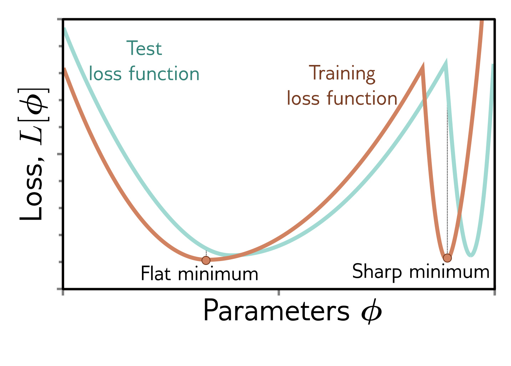

  

  <strong>Figure 20.11</strong> Flat vs. sharp minima. Flat minima are expected to generalize better. Small errors in estimating the parameters or in the alignment of the train and test loss functions are less problematic in flat regions. Adapted from Keskar et al. (2017).

ference when the hyperparameter search is done carefully (Choi et al., 2019). Keskar et al. (2017) show that deep nets generalize better with smaller batch-size when no other form of regularization is used. It is also well-known that larger learning rates tend to generalize better (e.g., figure 9.5). Jastrzębski et al. (2018), Goyal et al. (2018), and He et al. (2019) argue that the batch size/learning rate ratio is important. He et al. (2019) show a significant correlation between this ratio and the degree of generalization and prove a generalization bound for neural networks, which has a positive correlation with this ratio (figure 20.10).
These observations are aligned with the discovery that SGD implicitly adds regularization terms to the loss function (section 9.2), and their magnitude depends on the learning rate. The trajectory of the parameters is changed by this regularization, and they converge to a part of the loss function that generalizes well.

## 20.4.2 Flatness of minimum

There has been speculation dating at least to Hochreiter & Schmidhuber (1997a) that flat minima in the loss function generalize better than sharp minima (figure 20.11). Informally, if the minimum is flatter, then small errors in the estimated parameters are less important. This can also be motivated from various theoretical viewpoints. For example, minimum description length theory suggests models specified by fewer bits generalize better (Rissanen, 1983). For wide minima, the precision needed to store the weights is lower, so they should generalize better.

Flatness can be measured by (i) the size of the connected region around the minimum for which training loss is similar (Hochreiter & Schmidhuber, 1997a), (ii) the second-order curvature around the minimum (Chaudhari et al., 2019), or (iii) the maximum loss within a neighborhood of the minimum (Keskar et al., 2017). However, caution is required; estimated flatness can be affected by trivial reparameterizations of the network weights.

Nonetheless, Keskar et al. (2017) varied the batch size and learning rate and showed that flatness correlates with generalization. Izmailov et al. (2018) average together and training surfaces at the minimum and improves generalization. Other regularization techniques can also be viewed through this lens. For example, averaging model outputs (ensembling) may also make the test loss surface flatter. Kleinberg et al. (2018) showed
