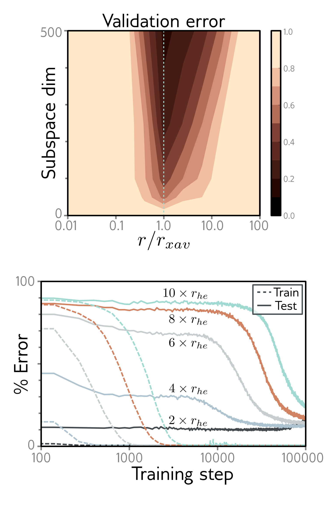

  

  <strong>Figure 20.12</strong> and <strong>Figure 20.13</strong> Weight norm and generalization. Figure 20.12 shows that a network trained on MNIST generalizes well only near a small range around the radius defined by Xavier initialization. Figure 20.13 shows grokking behavior: when parameters are initialized with an $\ell\_2$ norm much larger than He initialization, training and especially generalization take longer. Adapted from Fort & Scherlis (2019) and Liu et al. (2023c).

the model is overparameterized.
It follows that the norm of the weights can also be used to explain double descent. The norm of the weights increases when the number of parameters is similar to the number of data points (as the model contorts itself to fit these points exactly), causing generalization to reduce. As the network becomes wider and the number of weights increases, the overall norm of these weights decreases; the weights are initialized with a variance that is inversely proportional to the width (i.e., with He or Glorot initialization), and the weights need not change as drastically to fit the data well.

## 20.4.6 Leaving the data manifold

Until this point, we have discussed how models generalize to new data that is drawn from the same distribution as the training data. This is a reasonable assumption for experimentation. However, systems deployed in the real world may encounter unexpected data due to noise, changes in the data statistics over time, or deliberate attacks. Of course, it is harder to make definite statements about this scenario, but D'Amour et al. (2020) show that the variability of identical models trained with different seeds on corrupted data can be enormous and unpredictable.

Goodfellow et al. (2015a) showed that deep learning models are susceptible to adversarial attacks. Consider perturbing an image that is correctly classified by the network as “dog” so that the probability of the correct class decreases as fast as possible un-
