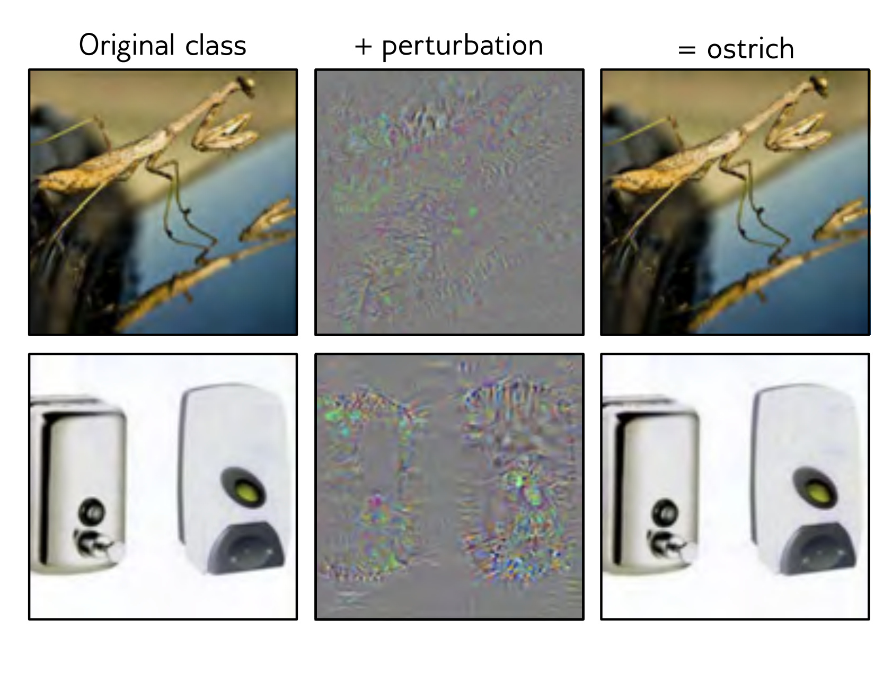

  

  <strong>Figure 20.14</strong> Adversarial examples. In each case, the left image is correctly classified by AlexNet. By considering the gradients of the network output with respect to the input, it’s possible to find a small perturbation (center) magnified by 10 for visibility) that, when added to the original image (right), causes the network to misclassify it as an ostrich. This is despite the fact that the original and perturbed images are almost indistinguishable to humans. Adapted from Szegedy et al. (2014).

til the class flips. If this image is now classified as an airplane, you might expect the perturbed image to look like a cross between a dog and an airplane. However, in practice, the perturbed image looks almost indistinguishable from the original dog image (figure 20.14).

The conclusion is that there are positions that are close to but not on the data manifold that are misclassified. These are known as adversarial examples. Their existence is surprising; how can such a small change to the network input make such a drastic change to the output? The best current explanation is that adversarial examples aren’t due to a lack of robustness to data from outside the training data manifold. Instead, they are exploiting a source of information that is in the training distribution but which has a small norm and is imperceptible to humans (Ilyas et al., 2019).

## 20.5 Do we need so many parameters?

Section 20.4 argued that models generalize better when over-parameterized. Indeed, there are almost no examples of state-of-the-art test performance on complex datasets where the model has significantly fewer parameters than there were training data points.

However, section 20.2 reviewed evidence that training becomes easier as the number of parameters increases. Hence, it’s not clear if some fundamental property of smaller models prevents them from performing as well or whether the training algorithms can’t find good solutions for small models. Pruning and distilling are two methods for reducing the size of trained models. This section examines whether these methods can produce underparameterized models which retain the performance of overparameterized ones.

## 20.5.1 Pruning

Pruning trained models reduces their size and hence storage requirements (figure 20.15). The simplest approach is to remove individual weights. This can be done based on the second derivatives of the loss function (LeCun et al., 1990; Hassibi & Stork, 1993) or
