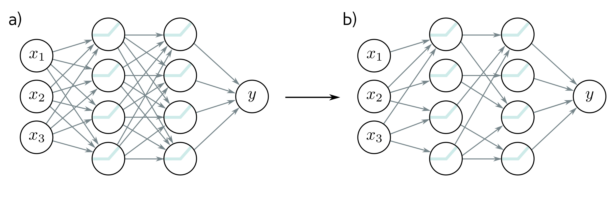

  

  <strong>Figure 20.15</strong> Pruning neural networks. The goal is to remove as many weights as possible without decreasing performance. This is often done just based on the magnitude of the weights. Typically, the network is fine-tuned after pruning. a) Example fully connected network. b) After pruning.

(more practically) based on the absolute value of the weight (Han et al., 2016, 2015). Other work prunes hidden units (Zhou et al., 2016a; Alvarez & Salzmann, 2016), channels in convolutional networks (Li et al., 2017a; Luo et al., 2017b; He et al., 2017; Liu et al., 2019a), or entire layers in residual nets (Huang & Wang, 2018). Often, the network is fine-tuned after pruning, and sometimes this process is repeated.

For example, Han et al. (2016) maintained good performance for the VGG network on ImageNet classes when 8% of the weights were retained. This significantly decreases the model size but isn’t enough to show that overparameterization is not required; the VGG network has  $\sim$ 100 times as many parameters as there are ImageNet training data (disregarding augmentation).

Pruning is a form of architecture search. In their work on lottery tickets (see section 20.2.7), Frankle & Carbin (2019) (i) trained a network, (ii) pruned the weights with the smallest magnitudes, and (iii) retrained the remaining network from the same initial weights. By iterating this procedure, they reduced the size of the VGG-19 network (originally 138 million parameters) by 98.5% on the CIFAR-10 database (60,000 examples) while maintaining good performance. For ResNet-50 (25.6 million parameters), they reduced the parameters by 80% without reducing the performance on ImageNet (1.28 million examples). These demonstrations are impressive but (disregarding data augmentation) these networks are still over-parameterized after pruning.

## 20.5.2 Knowledge distillation

The parameters can also be reduced by training a smaller network (the student) to replicate the performance of a larger one (the teacher). This is known as knowledge distillation and dates back to at least Bucilua et al. (2006). Hinton et al. (2015) showed that the pattern of information across the output classes is important and trained a smaller network to approximate the pre-softmax logits of the larger one (figure 20.16).
