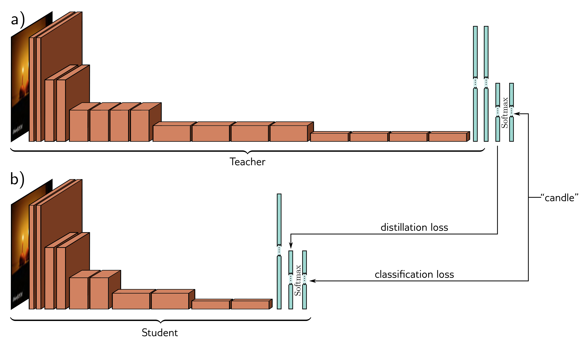

  

<strong>Figure 20.16</strong> Knowledge distillation. a) A teacher network for image classification is trained as usual, using a multiclass cross-entropy classification loss. b) A smaller student network is trained with the same loss, plus also a distillation loss that encourages the pre-softmax activations to be the same as for the teacher.

Zagoruyko & Komodakis (2017) further encouraged the spatial maps of the activations of the student network to be similar to the teacher network at various points. They use this attention transfer method to approximate the performance of a 34-layer residual network ( $\sim$ 63 million parameters) with an 18-layer residual network ( $\sim$ 11 million parameters) on the ImageNet classification task. However, this is still larger than the number of training examples ( $\sim$ 1 million images). Modern methods (e.g. Chen et al., 2021a) can improve on this result, but distillation has not yet provided convincing evidence that under-parameterized models can perform well.

## 20.5.3 Discussion

Current evidence suggests that overparameterization is needed for generalization — at least for the size and complexity of datasets that are currently used. There are no demonstrations of state-of-the-art performance on complex datasets where there are significantly fewer parameters than training examples. Attempts to reduce model size by pruning or distilling trained networks have not changed this picture.

Moreover, recent theory shows that there is a trade-off between the model’s Lipschitz constant and overparameterization; Bubeck & Sellke (2021) proved that in D dimensions,
