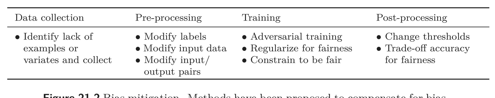

  

<table><tr><td>Data collection</td><td>Pre-processing</td><td>Training</td><td>Post-processing</td></tr><tr><td rowspan="3">● Identify lack of examples or variates and collect</td><td>● Modify labels
● Modify input data
● Modify input/ output pairs</td><td rowspan="3">● Adversarial training
● Regularize for fairness
● Constrain to be fair</td><td rowspan="3">● Change thresholds
● Trade-off accuracy for fairness</td></tr><tr><td>● Modify labels
● Modify input data
● Modify input/ output pairs</td></tr><tr><td>● Adversarial training
● Regularize for fairness
● Constrain to be fair</td></tr></table>

Figure 21. Bias mitigation. Methods have been proposed to compensate for bias at all stages of the training pipeline, from data collection to post-processing of already trained models. See Barocas et al. (2023) and Mehrabi et al. (2022).

online, the training data for future models is degraded. This may exacerbate biases and generate novel societal harm (Falbo & LaCroix, 2022).

Unfairness can be exacerbated by considerations of intersectionality; social categories can combine to create overlapping and interdependent systems of oppression. For example, the discrimination experienced by a queer woman of color is not merely the sum of the discrimination she might experience as queer, as gendered, or as racialized (Crenshaw, 1991). Within AI, Buolamwini & Gebru (2018) showed that face analysis algorithms trained primarily on lighter-skinned faces underperform for darker-skinned races. However, they perform even worse on combinations of features such as skin color and gender than might be expected by considering those features independently.

Of course, steps can be taken to ensure that data are diverse, representative, and complete. But if the society in which the training data are generated is structurally biased against marginalized communities, even completely accurate datasets will elicit biases. In light of the potential for algorithmic bias and the lack of representation in training datasets described above, it is also necessary to consider how failure rates for the outputs of these systems are likely to exacerbate discrimination against already-marginalized communities (Buolamwini & Gebru, 2018; Raji & Buolamwini, 2019; Raji et al., 2022). The resulting models may codify and entrench systems of power and oppression, including capitalism and classism; sexism, misogyny, and patriarchy; colonialism and imperialism; racism and white supremacy; ableism; and cis- and heteronormativity. A perspective on bias that maintains sensitivity to power dynamics requires accounting for historical inequities and labor conditions encoded in data (Micelli et al., 2022).

To prevent this, we must actively ensure that our algorithms are fair. A naive approach is fairness through unawareness which simply removes the protected attributes (e.g., race, gender) from the input features. Unfortunately, this is ineffective; the remaining features can still carry information about the protected attributes. More practical approaches first define a mathematical criterion for fairness. For example, the separation measure in binary classification requires that the prediction $\hat{y}$ is conditionally independent of the protected variable a (e.g., race) given the true label y. Then they intervene in various ways to minimize the deviation from this measure (figure 21.2).

A further complicating factor is that we cannot tell if an algorithm is unfair to a com-
