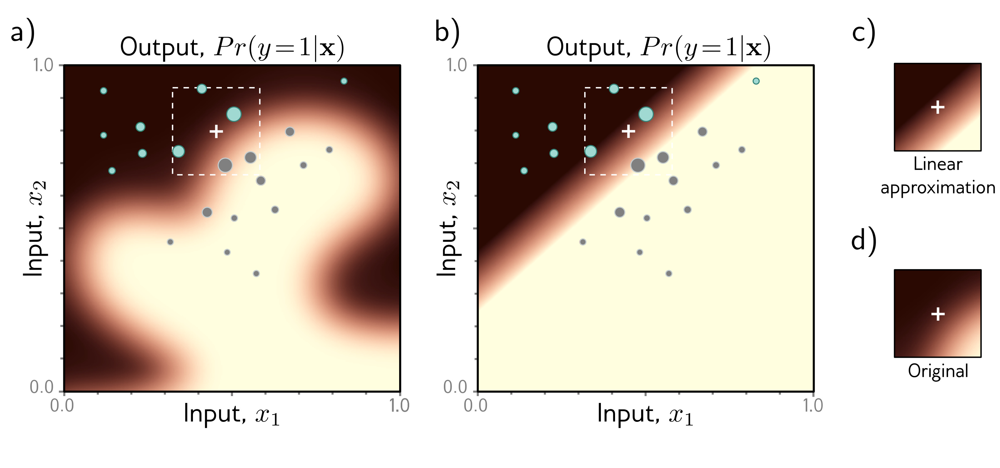

  

  <strong>Figure 21.3</strong> LIME. Output functions of deep networks are complex; in high dimensions, it’s hard to know why a decision was made or how to modify the inputs to change it without access to the model. a) Consider trying to understand why $\Pr(y = 1|x)$ is low at the white cross. LIME probes the network at nearby points to see if it identifies these as $\Pr(y = 1|x) < 0.5$ (cyan points) or point of interest (weight indicated by circle size). b) The weighted points are used to train a simpler model (here, logistic regression — a linear function passed through a sigmoid). c) Near the white cross, this approximation is close to d) the original function. Even though we did not have access to the original model, we can deduce from the parameters of this approximate model, that if we increase $x_{1}$ or decrease $x_{2}$ , $\Pr(y = 1|x)$ will increase, and the output class will change. Adapted from Prince (2022).

d)

## 21.2 Intentional misuse

The problems in the previous section arise from poorly specified objectives and informational asymmetries. However, even when a system functions correctly, it can entail unethical behavior or be intentionally misused. This section highlights some specific ethical concerns arising from the misuse of AI systems.

## 21.2.1 Face recognition and analysis

Face recognition technologies have an especially high risk for misuse. Authoritarian states can use them to identify and silence protesters, thus risking democratic ideals of free speech and the right to protest. Smith & Miller (2022) argue that there is a mismatch between the values of liberal democracy (e.g., security, privacy, autonomy, and accountability) and the potential use cases for these technologies (e.g., border security, criminal investigation and policing, national security, and the commercialization
